# Learning to Whistle Toki Pona

This is a beginner's path through the `suli` model, for people who already know
how to whistle but are new to phonetics jargon and to Toki Pona. It leans on
the audio already generated in `contexts/`, `lexicon/`, and `poem/`, plus a
small set of comparison drills in `lesson/suli/` made specifically for this
guide.

You don't need to read the phonetics theory in the main README to start —
this guide explains the same ideas in plain language, in the order you'll
actually need them.

## 0. What you're learning

Toki Pona normally has 9 consonants (`j k l m n p s t w`) and 5 vowels
(`a e i o u`). The whistled version can't reproduce all of that with a pure
tone, so it maps everything onto two independent things a whistle *can* do:

- **pitch** — how high or low you're whistling, and whether it's moving
- **volume** — whether the sound cuts off, fades smoothly, or stays steady

Every whistled vowel is just a held pitch. Every whistled consonant is a
brief pitch glide plus a particular volume shape, right before or after that
held pitch. That's the whole system — everything below is just naming the
parts.

## 1. Vowels: 3 pitches, not 5

Toki Pona's 5 vowels collapse into 3 whistled pitches:

| Whistled pitch | Covers |
|---|---|
| High | i, e |
| Mid | a |
| Low | o, u |

This merger is safe: no two words in the Toki Pona word list are
distinguished only by i-vs-e or by o-vs-u, so nothing gets confused (see the
"minimal pairs" note in the main README if you want the linguistic argument
for why).

**Listen:** [`lesson/suli/drill_vowels.wav`](lesson/suli/drill_vowels.wav) —
"a i o" whistled back to back. Try to whistle each pitch back before moving
on; this is your reference range for everything else.

**See it:** each vowel is just a flat pitch held at one of three heights —

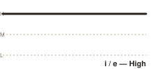 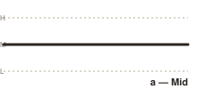 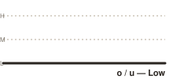

(the dashed lines in every diagram below are these same three reference
heights, so you can compare consonant glides against them)

## 2. Consonants are described by two labels: *locus* and *manner*

You'll see consonants described like "Acute Continuous" or "Grave Gradual."
Those are just coordinates on a 2-axis grid:

- **Locus** = *which direction and how far* the pitch glides, relative to
  your vowel pitch:
  - **Sharp** — glides way above the vowel range
  - **Acute** — glides up, but stays closer to the vowel range
  - **Mid** — no pitch glide, just a volume pulse
  - **Grave** — glides downward

- **Manner** = *how the volume behaves* during that glide:
  - **Interrupted** — cuts off sharply, with a clean silent gap
  - **Continuous** — dips smoothly, no silence at all
  - **Gradual** — dips smoothly all the way to silence

Not every combination is used. Here's the actual grid for `suli`:

| Locus \ Manner | Interrupted | Continuous | Gradual |
|---|---|---|---|
| Sharp   | t | j | — |
| Acute   | s | l | n |
| Mid     | k | w | — |
| Grave   | p | — | m |

**See it:** each diagram below shows the same syllable, `_a`, whistled —
the arrow is the consonant's pitch glide (up/down = locus, a circle = Mid's
"no glide, just a pulse"), and the line style right before the vowel is the
manner: solid = Continuous (no silence at all), a blank gap = Interrupted
(abrupt silence), fading dots = Gradual (smooth fade into silence). Full key:
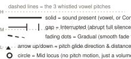

| Locus \ Manner | Interrupted | Continuous | Gradual |
|---|---|---|---|
| **Sharp** | 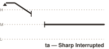 | 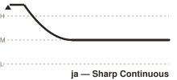 | — |
| **Acute** | 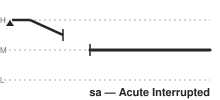 | 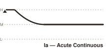 | 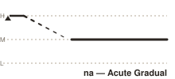 |
| **Mid** | 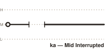 | 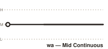 | — |
| **Grave** | 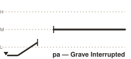 | — | 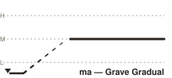 |

These diagrams are schematic teaching aids (relative pitch/timing, not
measured acoustic data) — generated by [`scripts/gen-diagrams.js`](scripts/gen-diagrams.js),
which you can re-run if you want to tweak the geometry.

## 3. Drills: hear the grid, row by row and column by column

Each file below whistles a few consonants back-to-back (all with vowel `a`)
so you can compare them directly in one breath, the way you'd compare
"bat/pat" in English.

**Compare loci** (same manner, different locus — this is usually the
easier contrast to hear first):
- [`drill_loci_interrupted.wav`](lesson/suli/drill_loci_interrupted.wav) — t · s · k · p (Sharp → Acute → Mid → Grave)
- [`drill_loci_continuous.wav`](lesson/suli/drill_loci_continuous.wav) — j · l · w (Sharp → Acute → Mid; Grave has no Continuous)

**Compare manners** (same locus, different manner — this is the subtler
contrast; take your time):
- [`drill_manner_sharp.wav`](lesson/suli/drill_manner_sharp.wav) — t · j
- [`drill_manner_acute.wav`](lesson/suli/drill_manner_acute.wav) — s · l · n
- [`drill_manner_mid.wav`](lesson/suli/drill_manner_mid.wav) — k · w
- [`drill_manner_grave.wav`](lesson/suli/drill_manner_grave.wav) — p · m

A good exercise: listen to a drill, pause, whistle back each syllable from
memory, then replay to check yourself.

## 4. Individual syllables, for closer listening

Once the drills above feel easy, `contexts/suli/` has every consonant
against every vowel individually (e.g. `ta.wav`, `sa.wav`, `pona`-relevant
combinations, etc.) — useful when you want to isolate one sound instead of
comparing several. `contexts/phones.txt` lists all of them.

Two sounds worth extra attention, per the main README: **/t/ vs /s/** (Sharp
vs Acute Interrupted — the closest pair in the whole system) and **starting
a sentence with "telo" or "selo"**, which is the one edge case where /t/ and
/s/ get harder to tell apart. Everywhere else they're reliably distinct.

## 5. Real words

`lexicon/suli/` has every word in the Classic Toki Pona word list as its own
file (`lexicon/words.txt` for the list itself). Once the drills feel
comfortable, start picking words from there — short ones first (`mi`, `sina`,
`jan`, `toki`, `pona`, `suli`) — and try whistling them before playing the
file, then check yourself.

**Phrases**, for when single words feel solid:
- [`phrase_toki_pona.wav`](lesson/suli/phrase_toki_pona.wav) — "toki pona" (the language's own name)
- [`phrase_jan_pona.wav`](lesson/suli/phrase_jan_pona.wav) — "jan pona" (a common greeting/term, "good person" / "friend")

## 6. Full-length practice

`poem/` contains a complete whistled poem ("tawa anpa nasa," `poem/poem.txt`
for the text) in both `suli` and `waso` models — good material once you're
comfortable with words and short phrases and want to work on connected
speech and word-boundary transitions (covered in the main README's section
on consonant clusters and word boundaries).

## What this guide doesn't teach you

This project (and this guide) only covers **pronunciation** — how to whistle
sounds that map onto Toki Pona's phonology. It does not teach Toki Pona
itself: vocabulary, grammar, or usage. Pair this with an actual Toki Pona
course or dictionary (e.g. [sona.pona.la](https://sona.pona.la/)) for that
side of things. Also, everything here is one-directional playback — nothing
in the software listens to *you* whistle back, so self-assessment by ear is
still on you.
